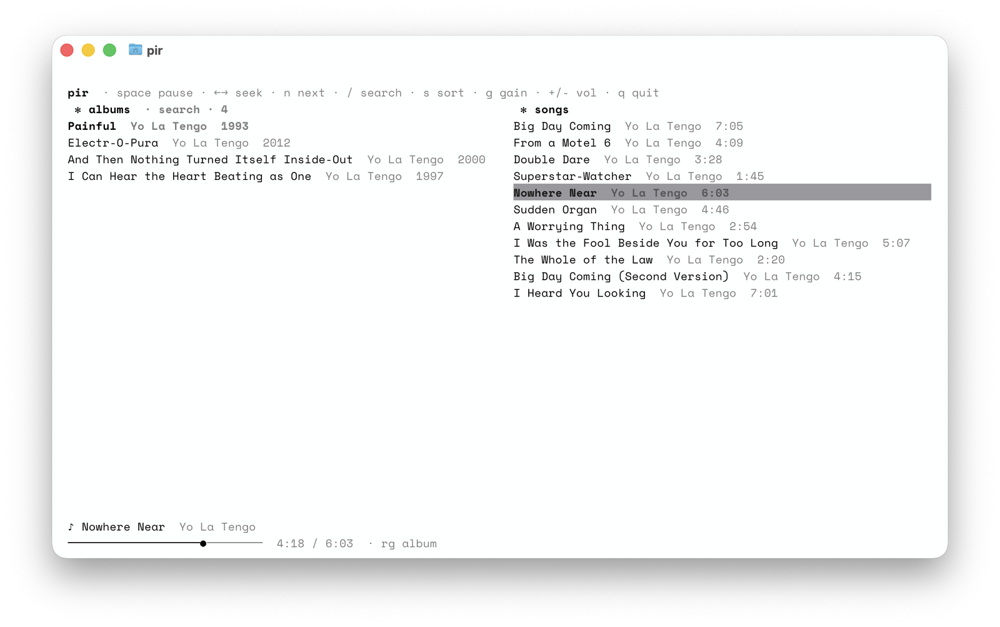

# [pir](https://www.youtube.com/watch?v=Zagwerydn7o)

simple [navidrome](https://www.navidrome.org/) client for the terminal



## needs

- python 3.11 or newer, 
- [mpv](https://mpv.io/) on your PATH

## install

with [uv](https://docs.astral.sh/uv/):

```sh
uv tool install .
```

[pipx](https://pipx.pypa.io/) does the same job if you'd rather:

```sh
pipx install .
```

the first run asks for your server url, username, and password. the
password goes into your system keychain via `keyring`. only the server
url, username, and replaygain mode are written to
`~/.config/pir/config.toml`, chmod 600. requests use subsonic salted-token
auth

## keys

| key             | does                                                   |
| --------------- | ------------------------------------------------------ |
| arrows          | move through the lists                                 |
| `tab`           | switch between albums and songs                        |
| `enter`         | on an album: open it · on a song: play from there      |
| `space`         | pause / resume                                         |
| `←` `→`         | scrub 5 seconds (hold shift for 30)                    |
| `n` `b`         | next / previous track                                  |
| `/`             | search albums (`tab` in the box switches to songs)     |
| `s`             | cycle sort: alphabetical, recently added, recently played, random |
| `r`             | jump straight to a fresh shuffle                       |
| `g`             | cycle replaygain: track, album, off                    |
| `+` `-`         | volume up / down — `=` works too, it's just `+` unshifted |
| `q`             | quit                                                   |

## scrobbling

pir reports what you're listening to as you listen to the server. i only did this for discord rpc

## replaygain

pir normalizes loudness through mpv's replaygain, using the tags in your
music files. it starts in `track` mode; press `g` to cycle track → album →
off (the footer shows the current mode). to start in a different mode, put
`replaygain = "album"` (or `"off"`) in `~/.config/pir/config.toml`

## forgetting a login

```sh
python3 -c "import keyring; keyring.delete_password('pir', 'YOUR_USERNAME')"
rm ~/.config/pir/config.toml
```

## tests

```sh
.venv/bin/pip install -e ".[dev]"
.venv/bin/python -m pytest -q
```

lint & format with ruff:

```sh
.venv/bin/ruff check .
.venv/bin/ruff format .
```

## license

[MIT](LICENSE)
